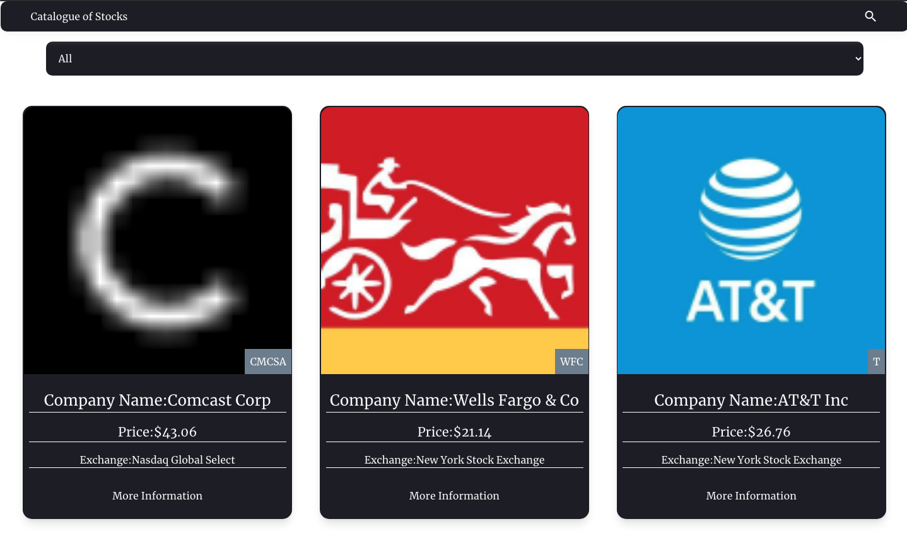
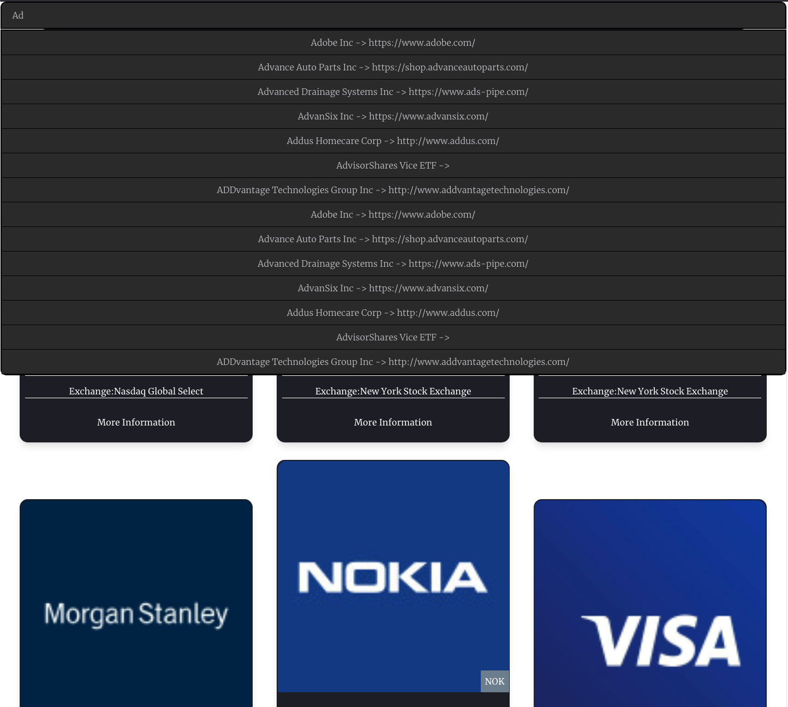
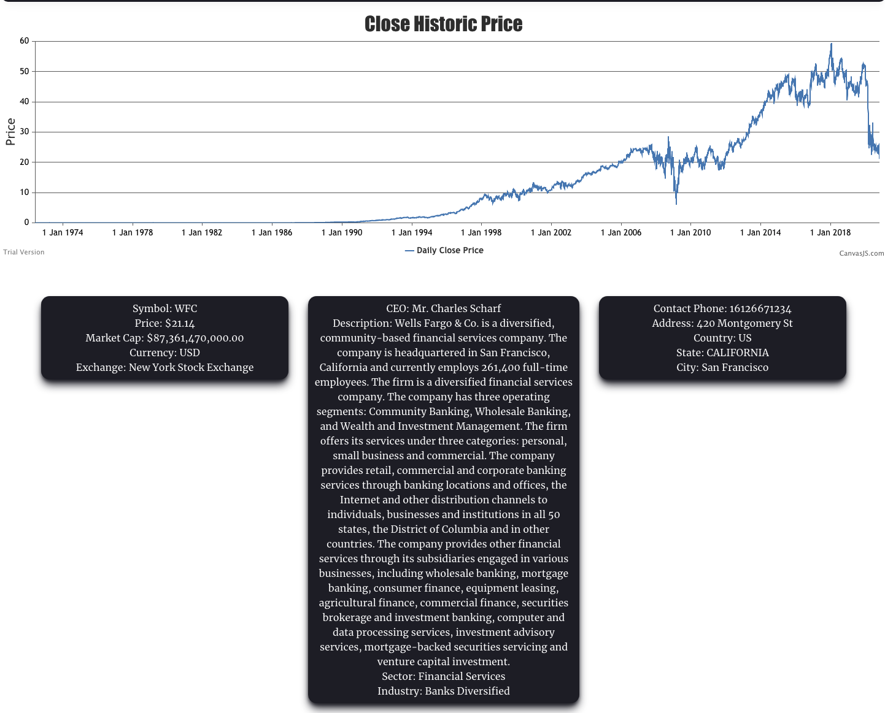

# Catalogue

A webapp that consists of a catalog, that is, a browsable list of items that you can filter and access to the details of one item. It uses a Public API to fetch the data that it renders. 

## About

This webapp pulls information from the [Financial Modeling Prop App](https://financialmodelingprep.com/). This API provides live data from stock in different exchanges. You can filter by exchange or search directly for your preferred stocks. Moreover, you can select them and view their historical price. 

## Live version

- [Live version](https://catalogue-stocks.netlify.app/)

## Snapshots

 

 

  
## Getting Started

- Fork the repository and create a local one on your computer;
- Move to the repository inside the command line using `cd` and the path to the file;
- Run dependencies with `npm install`
- Setup environmental variables. You must setup the API KEY and URL variable to properly run the code:
   - REACT_APP_API_URL = `Name of the main API url where all the endpoints are located at`
   - REACT_APP_API_KEY= `API Key needed to authenticate`
- Run the program locally by runnin `npm start`.

## Running tests

- Fork the repository and create a local one on your computer;
- Move to the repository inside the command line using `cd` and the path to the file;
- Run dependencies with `npm install`
- Run the tests locally by runnin `npm run test`.

## Built With
  - Bootstrapped with : `create-react-app`
  - React
  - Redux
  - Canvas JS
  - Netlify
  - Tailwind CSS
  - FMP API

## Author

👤 **Santiago Rodriguez Bermúdez**

  - Github: [@srba87](https://github.com/santiagorodriguezbermudez)
  - Twitter: [@srba87](https://twitter.com/srba87)
  - Linkedin: [srba87](https://linkedin.com/in/srba)

## 🤝 Contributing

  - Contributions, issues and feature requests are welcome!

  - Feel free to check the [issues page](./issues).

## Show your support

  - Give a ⭐️ if you like this project!
  